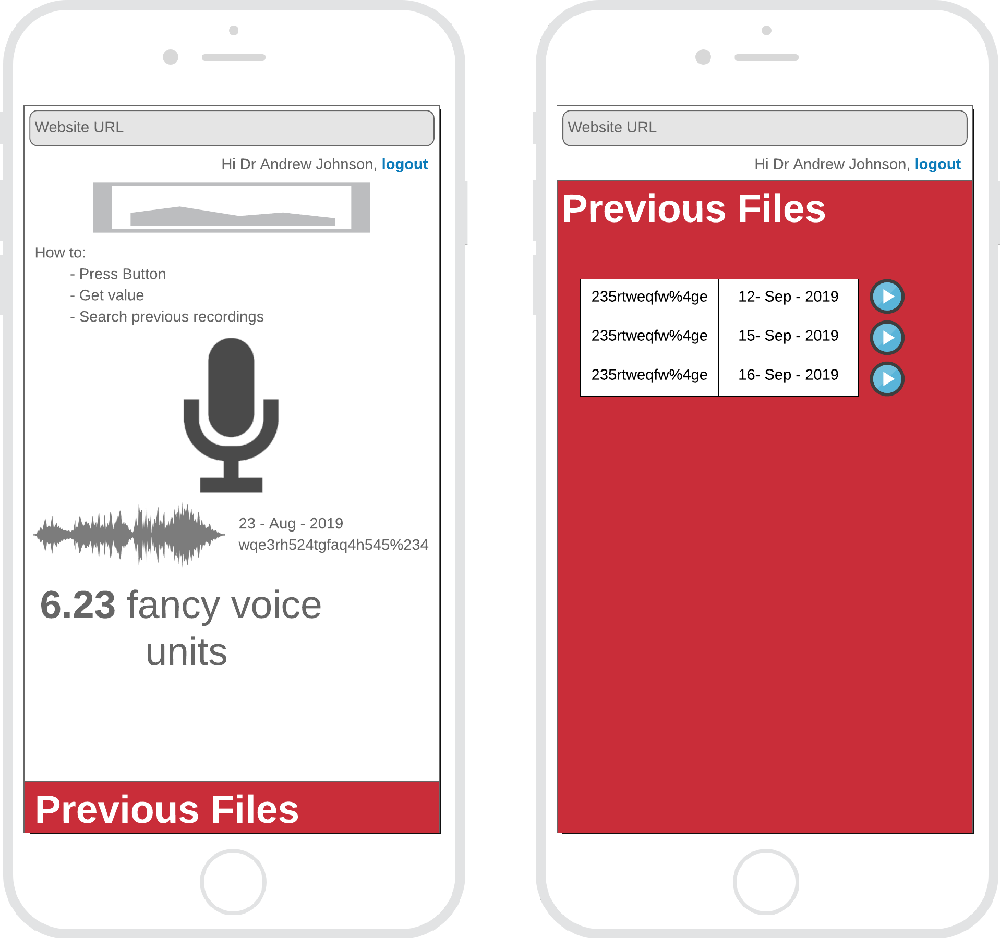

The official code repository for the ELS voice store web app.

# What is ELS Voice Store?
ELS Voice Store is an app for medical professionals and researchers to securely store and analyse the voices of patients. It's simple!


# How to run
You will need docker to develop. 
```
$ cd els.voice.store/docker
$ bash docker_start.sh
```

then go to: [http://127:0.0.1:5000](http://127:0.0.1:5000)